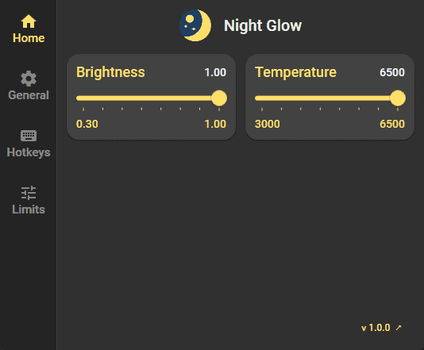
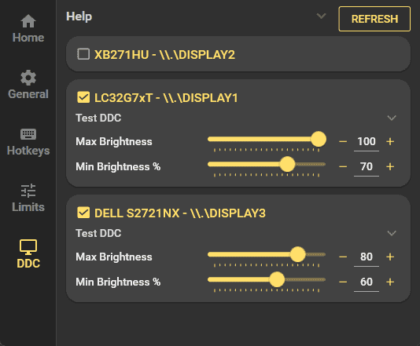
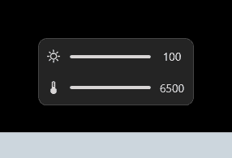

    

<h1 align="center">Night Glow</h1>

**Night Glow** is a Windows app that allows you to control screen brightness (using gamma or DDC/CI) and temperature using hotkeys.
It runs in the background in the system tray. Click the tray icon to open the main window, where you can adjust settings.

Inspiration taken from [f.lux](https://justgetflux.com/) and [LightBulb](https://github.com/Tyrrrz/LightBulb).

## Download
- [**Latest**](https://github.com/tombayley/NightGlow/releases/latest)
- [All releases](https://github.com/tombayley/NightGlow/releases)

If you encounter a popup saying "Windows protected your PC", or similar, click "More Info" in the popup and then click "Run" to continue installing.
Windows displays this security popup because the installer isn't signed. Signing costs hundreds of dollars per year and therefore isn't worth it.

The app is built and released automatically from source using GitHub Actions [here](.github/workflows/main.yml).

## Features
- Customizable hotkeys for brightness ↑/↓, temperature ↑/↓, brightness & temperature ↑/↓
- Custom brightness & temperature min/max/step values
- Low resource usage
- Control monitor brightness natively using DDC/CI

## Features not included
- Smooth transition between brightness/temperature levels
- Day/night modes for automatic transition at sunrise/sunset

## Screenshots

    
     
     
    
     
     
    
     
     
    
     
     
    
     
     
    

